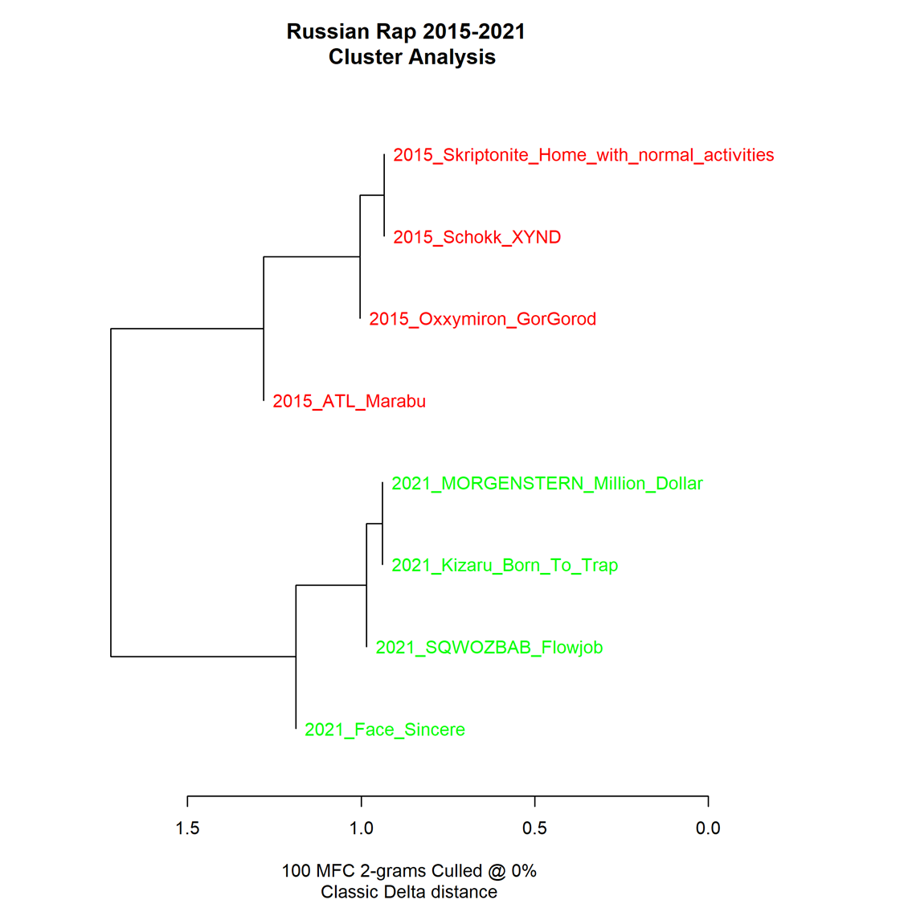

# Русский рэп 2015-2021 гг. 

Визуализация представляет собой отношение стилей разных рэп исполнителей друг к другу. За основу была взята работа, выполненная посредством инструмента Stylo. Напомним её результаты: 

